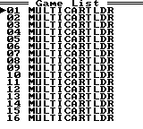

ChisFlash Menu
==============

# Overview

A custom menu ROM for the **ChisFlash MBC5 "MAX 16-in-1"** Game Boy / Game Boy Color
multicart. Lists all 16 game slots on one screen, reads each game's name straight
from its header, and can auto-boot the last game you played (with a short,
cancellable countdown) using the cart's own CPLD multicart registers.

Written in RGBDS assembly; builds to a plain 32 KB `.gb`/`.gbc` ROM.

# Features



* 16-game menu, one line per slot, no scrolling — arrow-key navigation with wrap-around
* Game names read live from each flashed ROM's header; empty slots are marked
* Auto-boot the last played game on power-on, with a ~3s on-screen countdown;
  any button cancels, holding **Select** at boot skips the countdown entirely
* Menu remembers the last-highlighted slot across power cycles (uses the cart's
  battery-backed SRAM)
* Game launch and slot selection go through the ChisFlash CPLD's own registers —
  see the comments in `main.asm` for the full register map

# Building

Requires [RGBDS](https://rgbds.gbdev.io) and `make`.

```
make
```

produces `multicartldr-0.9.gb` and `multicartldr-0.9.gbc`.

# Tools

**`chismax_build.py`** — packs the menu ROM and up to 16 game ROMs into the full
32 MiB flash image this cart expects, laid out to match the CPLD's slot map
(1 MiB menu, 1 MiB for game 1, 2 MiB each for games 2-16). Refuses to build if
any ROM overflows its slot.

```
python3 chismax_build.py multicartldr-0.9.gbc game1.gb game2.gb ... -o chismax_32m.gbc
```

**`mbc5_patch.py`** — this cart's CPLD only implements MBC5 banking, so a game
using a different mapper (MBC1) needs its bank-switching code
rewritten to MBC5 before it will run here. This applies one of
[Lesserkuma](https://github.com/Lesserkuma)'s BPS patches (looked up by source-ROM
CRC32) to do that conversion for a single ROM.

```
python3 mbc5_patch.py game.gb                    # look up only, no changes written
python3 mbc5_patch.py game.gb -o game_mbc5.gb    # apply the patch
```

It needs the patch database, `mapper_patches_b64.js`, which is **not bundled in
this repo** — download it from Lesserkuma's
[GBMem-Menu_256M](https://github.com/Lesserkuma/GBMem-Menu_256M) project
([`res/mapper_patches_b64.js`](https://github.com/Lesserkuma/GBMem-Menu_256M/blob/main/res/mapper_patches_b64.js)):

```
curl -O https://raw.githubusercontent.com/Lesserkuma/GBMem-Menu_256M/main/res/mapper_patches_b64.js
```

and place it alongside the script (or pass `--patches <path>`).

# Acknowledgements

This started as a fork of **[NekoCart-GB](https://ncgb.zephray.me)** by Wenting Zhang
(zephray) — an open-source Game Boy flash cartridge with its own Xilinx CPLD design,
licensed GPLv3. NekoCart's `MultiCartLoader` (this repo's origin) supplied the
overall structure of the menu — the bank-switching approach, the IBM-PC character
set macros, and the low-level memory/VRAM helpers, themselves credited in the
source file headers to Jeff Frohwein / "GABY" (devrs.com). NekoCart's own CPLD and
PCB design are not part of this repository, since this project targets different
(ChisFlash) hardware; see the upstream project linked above for that original
cartridge design.

This menu's game-launch and multi-slot logic targets the **ChisFlash** MBC5
"MAX 16-in-1" cartridge's CPLD specifically — its register protocol (ROM/RAM
banking, game selection, and the reset sequence used to boot into a selected
game) was reverse-engineered from that cart's own CPLD design. ChisFlash is an
independent third-party hardware product; this repository is not affiliated
with, endorsed by, or officially supported by its maker.

`mbc5_patch.py`'s mapper-conversion patches come from
[Lesserkuma](https://github.com/Lesserkuma)'s
[GBMem-Menu_256M](https://github.com/Lesserkuma/GBMem-Menu_256M) project — see
the **Tools** section above. That patch database is fetched separately and is
not redistributed in this repository; see the upstream project for its own
license terms.

# License

GNU GPLv3, inherited from the NekoCart-GB project this was forked from.

# Legalese

This project is an independent, unofficial piece of software. It is not
affiliated with, endorsed by, or sponsored by **Nintendo** or by **ChisFlash**
in any way.

Game Boy® and Game Boy Color® are registered trademarks of Nintendo. All other
trademarks are the property of their respective owners.
